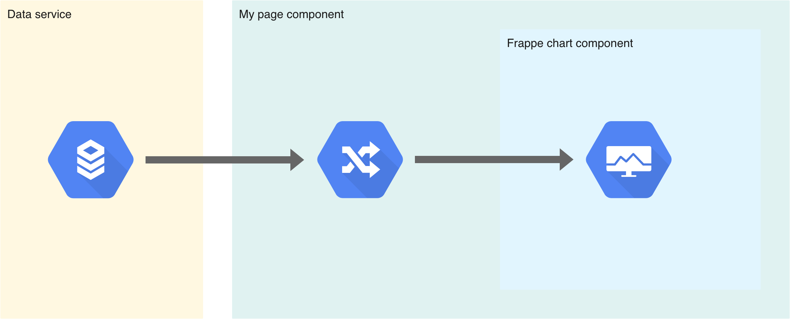

# Keypoints

## Charts

A dedicated component allows you to generate graphs by taking advantage of the frappe-charts library.

In order to be reactive, this component requires an observable as a data source. This allows it to efficiently generate and update the values displayed in the graph.



You need to change the observable data stream with pipe operators to shape the datas according the data shema required by the graph.

In the follownig example, the `flux$` observable is piped to the `map()` rxjs oberator to shape the data flow. Then the `graphFlux$` observable can be passed to the graph.

```ts
this.graphFlux$ = this.flux$.pipe(
  // Map the observable stream to format the data for the graph
  map((flux: Array<any>) => {
    return {
      labels: flux.map(e => e.timestamp.toDate().toLocaleDateString()),
      datasets: [
        {
          values: flux.map(e => e.message )
        }
      ]
    };
  })
);
```

## Route auth guard

To protect routes that require authentication, the router uses guards to check the status of the firebase authentication.

To perform this verification the guard needs to check the actual state (for reactivity if the state is already loaded), or if the the state is not loaded, perform a asynchronous verfication to wait the state loading.

```ts
canActivate(
  route: ActivatedRouteSnapshot,
  state: RouterStateSnapshot
): Observable<boolean | UrlTree> | Promise<boolean | UrlTree> | boolean | UrlTree {
  // Check the authenication
  if (this.auth.authenticated) { return true; }
  // If the state is not loaded, perform the checks on the authenticatedUser observable
  return this.auth.authenticatedUser.pipe(
    map(user => !!user),
    take(1),
    tap(allowed => {
      if (!allowed) {
        this.router.navigate(['/log-in']);
        this.message.warning('Connectez vous pour accéder a ce contenu.');
      }
    })
  );
}
```
